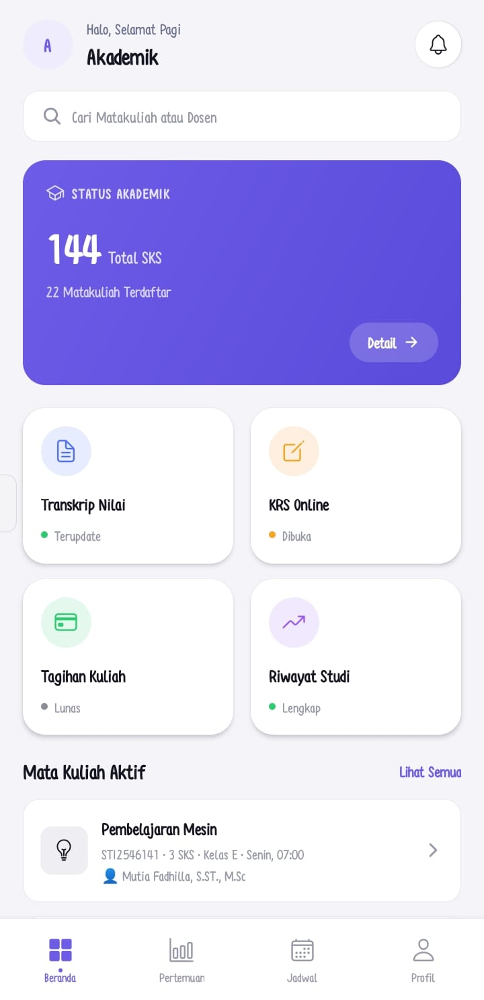
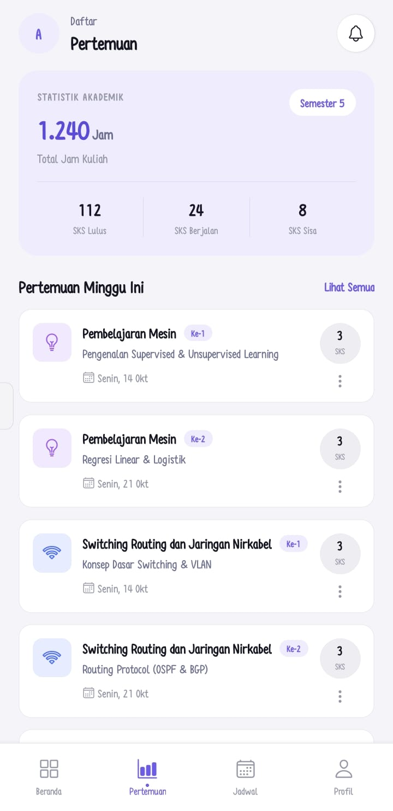
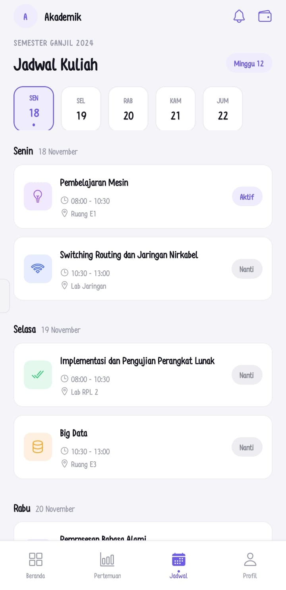
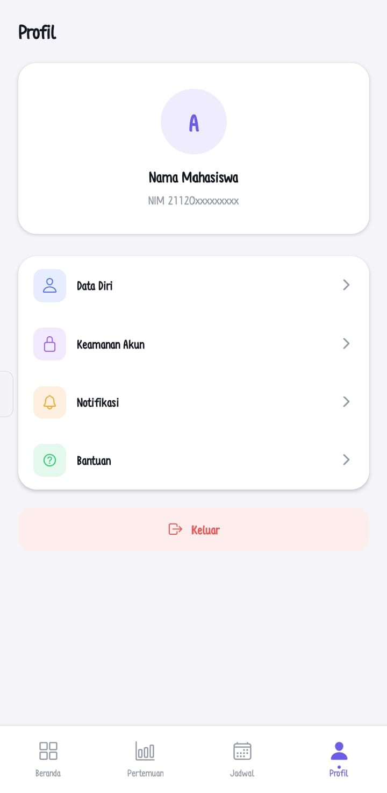

# Jadwal Kuliah App

Tugas Praktikum Pemrograman Mobile — **Handling Lists & Data Rendering**.

Aplikasi React Native (Expo) yang menampilkan jadwal kuliah menggunakan tiga
teknik rendering list berbeda, dengan data statis (hardcode), dan tampilan
dashboard bergaya modern.

## Fitur & Teknik Rendering (Ketentuan Tugas)

| Halaman (Tab)  | Teknik        | Isi                                                       |
|----------------|---------------|-------------------------------------------------------------|
| **Beranda**    | `.map()`      | Status akademik, aksi cepat, dan daftar mata kuliah aktif   |
| **Pertemuan**  | `FlatList`    | Statistik akademik + daftar pertemuan (min. 10 item)        |
| **Jadwal**     | `SectionList` | Jadwal dikelompokkan per hari + selector hari horizontal    |
| Profil         | —             | Halaman pelengkap navigasi       |

`FlatList` pada halaman Pertemuan mengimplementasikan:
- `keyExtractor`
- `ItemSeparatorComponent`
- `ListHeaderComponent` (kartu statistik + judul section)
- `ListEmptyComponent`

`SectionList` pada halaman Jadwal:
- Header per seksi (nama hari + tanggal) dengan gaya berbeda dari item biasa
- `renderSectionFooter` menampilkan status "Tidak ada jadwal kuliah" untuk
  hari tanpa jadwal 

## Struktur Proyek

```
jadwal-kuliah-app/
├── App.js                     
├── constants/
│   └── theme.js              
├── components/
│   └── AppHeader.js           
├── data/
│   ├── mataKuliah.js          
│   ├── dashboard.js           
│   ├── pertemuan.js           
│   └── jadwal.js              
└── screens/
    ├── BerandaScreen.js
    ├── PertemuanScreen.js
    ├── JadwalScreen.js
    └── ProfilScreen.js
```

## Cara Menjalankan

1. Install dependencies:
   ```bash
   npm install
   ```
2. Jalankan Expo:
   ```bash
   npx expo start
   ```
3. Scan QR code dengan aplikasi **Expo Go** (Android/iOS), atau tekan `w`
   untuk membuka di web browser.

> Pastikan versi **Expo Go** di HP kamu sama dengan SDK di `package.json`
> (`expo": "^54.0.35"`). Jika beda, lihat pesan error di layar untuk versi
> yang dibutuhkan dan minta bantuan menyesuaikan.

## Mengganti Data

Semua data ada di folder `data/`. Edit langsung array di dalam file:
- `data/mataKuliah.js` — daftar mata kuliah + ikon + jadwal singkat
- `data/dashboard.js` — status akademik, aksi cepat, statistik
- `data/pertemuan.js` — daftar pertemuan (FlatList)
- `data/jadwal.js` — jadwal per hari (SectionList)

Ikuti struktur field yang sudah ada (lihat komentar di masing-masing file).
Nama ikon memakai [Ionicons](https://icons.expo.fyi) — cari nama ikon di
situs tersebut lalu tulis persis namanya di field `icon`.

## Screenshot

| Beranda | Pertemuan |
|---|---|
|  |  |

| Jadwal | Profil |
|---|---|
|  |  |


---
Dibuat untuk memenuhi tugas praktikum Pemrograman Mobile.
